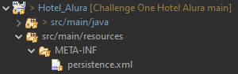
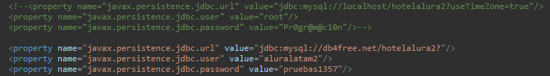

# Hotel Alura-Challenge Oracle Next Education (ONE)
## Índice

- [Descripción del Proyecto](#descripción-del-proyecto-page_facing_up)
- [Funcionalidad del Programa](#funcionalidad-del-programa-white_check_mark)
- [Herramientas utilizadas](#hammer-herramientas-utilizadas-wrench)

## **Descripción del Proyecto:** :page_facing_up:
Esta es mi solución al cuarto Challenge ONE propuesto por Alura, Esté consta de crear un programa con el cual poder realizar el registro de reservas y huéspedes, así como poder administrarlas.
El apartado visual fue proporcionado por el equipo de Alura.
### :warning: Nota: :warning:
Este programa utiliza [db4free](https://www.db4free.net/ "db4free") el cual es un servicio que proporciona soporte para la Database MySQL, este servicio es gratuito. Si desea usar una Database  Local, debe entrar en el archivo Persistence.xml, en este encontrará una conexión comentada, en la cual puede colocar su Database (esta solo debe tener el nombre “hotelalura2” al iniciar el programa las tablas se crearán) y la segunda puede eliminarla o comentarla.

## **Funcionalidad del Programa:** :white_check_mark:
 Al abrir el programa encontrará un botón "Login". 
 Al hacer click en el botón se nos abrirá el "Inicio de Sesión" este nos pide un Usuario y una contraseña (El usuario es  "User" y la contraseña es "password1234") .
 Al iniciar sesión entraremos en el menú de usuario, en este tenemos 2 botones "Registro de reservas" y "Búsqueda", el primero nos permite registrar una reserva y el segundo administrar las reservas y huéspedes del Hotel Alura . 
 

 El registró de reserva nos pide 5 parámetros, estos tienen varias restricciones para garantizar una reserva válida. Una vez realizada la reserva, nos pedirá registrar un huésped, este apartado también cuenta con varias restricciones para garantizar un huésped válido, además de revisar si el usuario ya existe, en ese caso la reserva se añadirá a él.
 

 El apartado de Búsqueda nos permite administrar las reservas, este posee varias funciones, tales como editar o eliminar registros, búsqueda por uno o los dos apellidos, varios números de reserva, busca automáticamente si presionas sobre las reservas de un huésped y la recarga de registros si es necesario.

## :hammer: **Herramientas utilizadas:** :wrench:
- La versión de java utilizada es [Java SDK versión 19.0.2](https://www.oracle.com/java/technologies/downloads/).
- El IDE usado fue [Eclipse versión 2022-12 (4.26.0)](https://www.eclipse.org/downloads/).
- La base de datos fue [MySQL](https://www.mysql.com/).
- El Host para la Datebase es [db4free](https://www.db4free.net/ "db4free").
- Para implementar la interfaz gráfica se usó [WindowBuilder](https://www.eclipse.org/windowbuilder/).

